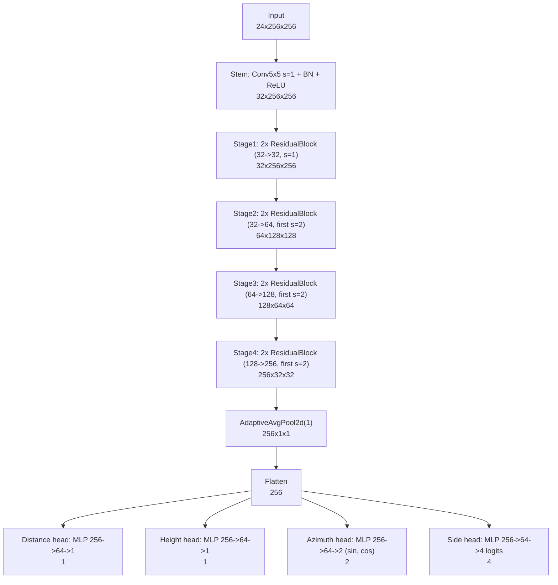

# MultiTask ResNet Kendall V4 Architecture

Generated by:

```bash
uv run python models/multitask_resnet_kendall_v4/generate_architecture_diagram.py
```

## Diagram



## Parameter Summary

| Component | Parameters |
|---|---:|
| total | 2,879,688 |
| backbone | 2,813,376 |
| distance_head | 16,513 |
| height_head | 16,513 |
| azimuth_head | 16,578 |
| side_head | 16,708 |

## Output Tensors

- distance: scalar regression (meters)
- height: scalar regression (meters)
- azimuth_xy: 2D circular vector `[sin(theta), cos(theta)]`
- side_logits: 4-class logits `[Front, Right, Back, Left]`

Default generated input shape: `24x256x256`.