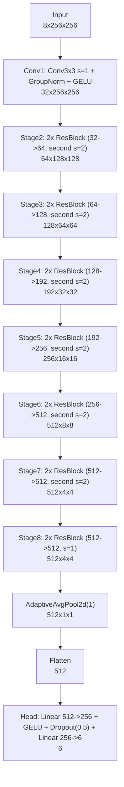

# Original Paper ResNet Architecture

Generated by:

```bash
uv run python models/original/generate_architecture_diagram.py
```

## Diagram



## Parameter Summary

| Component | Parameters |
|---|---:|
| total | 32,225,862 |
| trunk (conv1 + conv2_x..conv8_x) | 32,092,992 |
| head | 132,870 |

## Output Tensor

- `6` values: `[distance, height, sin(azimuth), cos(azimuth), sin(side), cos(side)]`

Default generated input shape: `8x256x256`.